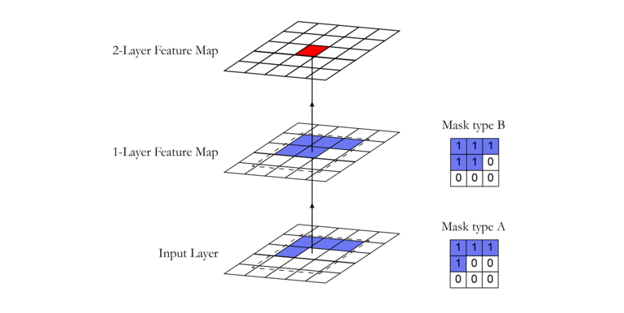
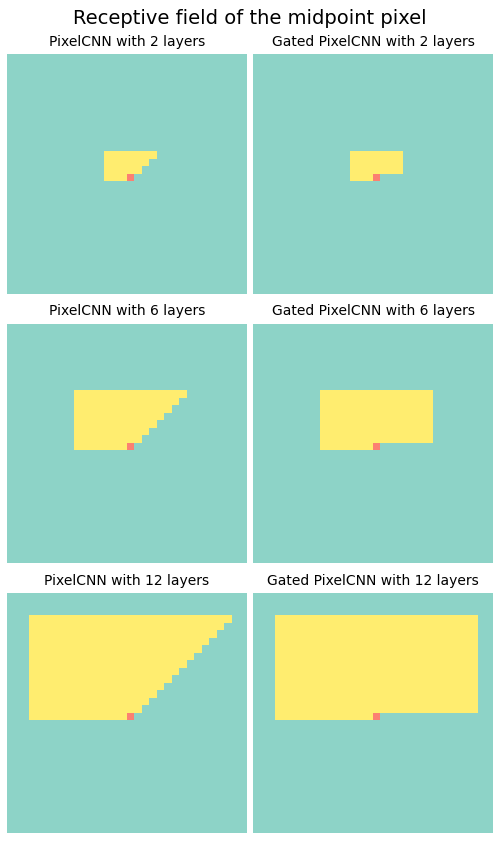

# PixelCNN

The code is an implementation of the *PixelCNN* model and is heavily inspired by
the Berkeley course *CS294 Deep Unsupervised Learning*. The architecture of the
model is presented in:
  * *Pixel Recurrent Neural Networks* by van den Oord et al.,
  ([here](https://arxiv.org/abs/1601.06759))
  * *Conditional Image Generation with PixelCNN Decoders* by van den Oord et al.,
  ([here](https://arxiv.org/abs/1606.05328))

NOTE: the implementation does not include conditional generation (yet).

The PixelCNN model takes a `C x H x W` image as input and produces `d x C x H x W`
predictions as output. The model scans the image row-by-row pixel-by-pixel
and predicts the conditional distribution over the `d` possible pixel values
given the scanned context. Multiple convolutional layers that preserve the spatial
resolution are used. Down-sampling is not applied. The original architecture of
the *PixelCNN* proposed to use a masked convolving kernel in order to impose
the auto-regressive property on the activations.



However, this type of masking introduces a problem with the receptive field of
the pixels, the so-called "blind spot". To fix the problem two convolutional
network stacks are combined -- one that conditions on the current row (horizontal
stack) and one that conditions on all rows above (vertical stack). An image of
the architecture of the gated layer is shown below:


In order to fix the "blind spot" issue we need to implement two types of layers:
  * Type A - mask the vertical filter to exclude the current row; mask the
    horizontal filter to exclude the current pixel
  * Type B - mask the vertical filter to include the current row; mask the
    horizontal filter to include the current pixel
The first gated layer will be of type A and every other gated layer will be of
type B. The "blind spot" issue as well as the fix provided by the gated layer
can be seen by plotting the receptive field of an arbitrary pixel.

```python
x = torch.ones(size=(1, C, H, W))
x.requires_grad = True
m, k = H // 2, W // 2
out = model(x)                # shape B, d, C, H, W
out[0, 0, 0, m, k].backward() # bag-prop the mid value
grad = x.grad.detach().cpu().numpy()[0][1]      # predict Green observing Red channels)
grad = (np.abs(grad) > 1e-8).astype(np.float32) # 0 if no connection, 1 if connected
grad[m, k] = 0.33 # mark the current pixel
plt.imshow(grad)  # plot the receptive field
```



## Structure
The following modules are implemented:

  * `conv2d_mask.py` implements a masked 2d convolutional layer.
  * `conv2d_gated.py` implements the gated convolutional block that is used by
    the gated *PixelCNN*.
  * `positional_norm.py` implements a normalization layer the normalizes along
    the channel dimensions by respecting the auto-regressive property of the
    channels.
  * `pixelcnn.py` implements the gated *PixelCNN* model.


## Training
Train *PixelCNN* to model the probability distribution of the CIFAR-10 dataset.

To train the model run:
```bash
python3 run.py --seed=0 --lr=3e-4 --epochs=50 --verbose
```

The script will download the CIFAR-10 dataset into a `datasets` folder and will
train the model on it. The trained model parameters will be saved to the file
`pixelcnn.pt`.


## Generation
To use the trained model for generating CIFAR-10 images run the following:
```python
model = torch.load("pixelcnn.pt")
img = model.sample()        # img,shape = (1, 3, 32, 32)
plt.imshow(img[0].permute(1, 2, 0))
```
Note that the process of generating an image takes time proportional to the
number of dimensions.

To speed things up you could generate multiple images at once:
```python
model = torch.load("pixelcnn.pt")
imgs = model.sample(n=36)  # img,shape = (36, 3, 32, 32)
grid = torchvision.utils.make_grid(imgs, nrow=6)
plt.imshow(grid.permute(1, 2, 0))
```

This is what the model generates after training for 50 epochs.

