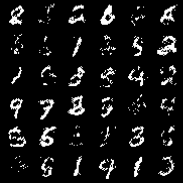

# Masked-Autoencoder for Distribution Estimation (MADE)

The code is an implementation of the masked auto-encoder architecture presented
in the ([paper](https://arxiv.org/abs/1502.03509)) *Masked Autoencoder for
Distribution Estimation* by Germain et. al.

This code is inspired by the Berkeley course *CS294 Deep Unsupervised Learning*
and also by Andrej Karpathy's implementation
([given here](https://github.com/karpathy/pytorch-made))

NOTE: this implementation does not include order-agnostic and
connectivity-agnostic training.


## Training
Train *MADE* to model the probability distribution of the binarized MNIST dataset.
Given a binary image of height $H$ and width $W$, $x \in \\\{0, 1\\\}^{H \times W}$,
we can represent that image as a flattened binary vector $x \in \\\{0, 1\\\}^{HW}$.

To train the model run:
```bash
python3 run.py --seed=0 --lr=3e-4 --epochs=350 --verbose
```

The script will download the MNIST dataset into a `datasets` folder and will
train the model on it. The trained model parameters will be saved to the file
`made.pt`.


## Generation
To use the trained model for generating MNIST images run the following:
```python
model = torch.load("made.pt")
img = model.sample()        # img,shape = (1, 1, 28, 28)
plt.imshow(img[0].permute(1, 2, 0))
```
Note that the process of generating an image takes time proportional to the
number of dimensions.

To speed things up you could generate multiple images at once:
```python
model = torch.load("made.pt")
imgs = model.sample(n=36)   # img,shape = (36, 1, 28, 28)
grid = torchvision.utils.make_grid(imgs, nrow=6)
plt.imshow(grid.permute(1, 2, 0))
```

This is what the model generates after training for 350 epochs.

