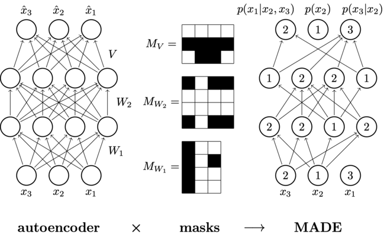

# Masked-Autoencoder for Distribution Estimation (MADE)

This project contains a PyTorch implementation of the *"Masked Autoencoder for
Distribution Estimation"* by Germain et. al., 2015. The code is heavily inspired
by the Berkeley course *CS294 Deep Unsupervised Learning*.

This is a simple implementation of the architecture presented in the paper:
 * *Masked Autoencoder for Distribution Estimation* by Germain et. al.
 ([here](https://arxiv.org/abs/1502.03509))

The implementation does not include order-agnostic and connectivity-agnostic
training.

The following modules are implemented:
 * `mask_linear.py` implements a simple masked linear layer.
 * `made.py` implements the *MADE* model

This implementation allows the input to be ordinal or categorical. Categorical
input data is converted to one-hot encoding before being forwarded through the
network. For examples on training on categorical and on ordinal data see
`example.ipynb`.
