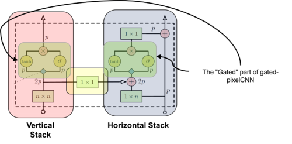

# PixelCNN

This project contains a PyTorch implementation of the *PixelCNN* model as
described in:
  * *Pixel Recurrent Neural Networks* by van den Oord et al.,
  ([here](https://arxiv.org/abs/1601.06759))
  * *Conditional Image Generation with PixelCNN Decoders* by van den Oord et al.,
  ([here](https://arxiv.org/abs/1606.05328))

The code is heavily inspired by the Berkeley course *CS294 Deep Unsupervised
Learning*.

The implementation does not include conditional generation (yet).

The original architecture of the *PixelCNN* proposed to use a masked convolving
kernel in order to impose the auto-regressive property on the activations.
However, this type of masking introduced a problem with the receptive field of
the pixels, the so-called "blind spot". To fix the problem two convolutional
network stacks are combined -- one that conditions on the current row (horizontal
stack) and one that conditions on all rows above (vertical stack).

The following modules are implemented:

  _for the original PixelCNN model_
  * `conv2d_mask.py` implements a masked 2d convolutional layer.
  * `positional_norm.py` implements a normalization layer the normalizes along
    the channel dimensions by respecting the auto-regressive property of the
    channels.
  * `residual_block.py` implements a residual block of convolutional layers
    used in the *PixelCNN* model.
  * `pixelcnn.py` implements the *PixelCNN* model.

  _for the gated PixelCNN model_
  * `conv2d_gated.py` implements the gated convolutional block that is used by
    the gated *PixelCNN*.
  * `pixelcnn_gated.py` implements the gated *PixelCNN* model.